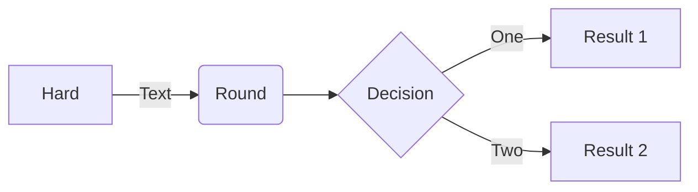

# Éconoris

# Table des matières

- [Éconoris](#éconoris)
- [Table des matières](#table-des-matières)
- [Présentation](#présentation)
- [Fonctionnalités](#fonctionnalités)
- [Architecture](#architecture)
- [Technologies utilisées](#technologies-utilisées)
- [Installation](#installation)
- [Autheur](#autheur)
- [Report de bug et suggestions](#report-de-bug-et-suggestions)
- [License](#license)

# Présentation

# Fonctionnalités

# Architecture

# Technologies utilisées

# Installation

# Autheur

Finance dashboard est un projet open-source développé seulement par [Floris Robart](https://florobart.github.io/)

# Report de bug et suggestions

Si vous découvrez une erreur, quelquelle soit, cela peut êgre une faute de frappe ou d'orthographe, une erreur de calcul, une erreur de conception, un bug qui empêche le bon fonctionnement de l'application, ou tout autre problème, Merci de me le signaler par mail à l'adresse [florobart.github@gmail.com](mailto:florobart.github@gmail.com). Toutes les erreurs, quelque soit leur nature ou leur importance, seront traitées le plus rapidement possible.

Si vous avez une une **suggestion**, une **idée**, une **amélioration**, ou une **demande de fonctionnalité**, merci de me la communiquer par mail à l'adresse [florobart.github@gmail.com](mailto:florobart.github@gmail.com). Toutes les suggestions, quelque soit leur nature ou leur importance, seront étudiées et prises en compte dans la mesure du possible.

# License

Finance dashboard est un projet open-source sous licence [GNU General Public License v3.0](https://opensource.org/licenses/GPL-3.0).
