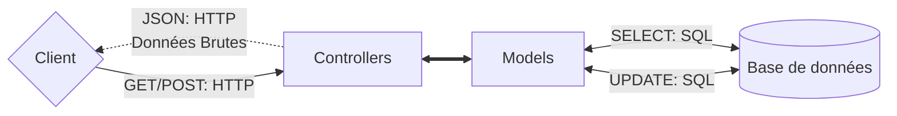
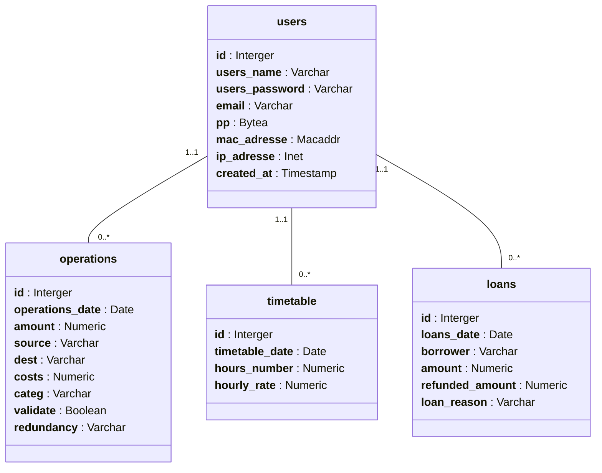

# Éconoris

# Table des matières

<details>
<summary>Expand contents</summary>

- [Éconoris](#éconoris)
- [Table des matières](#table-des-matières)
- [Présentation](#présentation)
- [Fonctionnalités](#fonctionnalités)
- [Architecture de l'application](#architecture-de-lapplication)
- [Architecture de la base de données](#architecture-de-la-base-de-données)
  - [Modèle Conceptuel de Données (MCD)](#modèle-conceptuel-de-données-mcd)
  - [Modèle Logique de Données (MLD)](#modèle-logique-de-données-mld)
- [Routes](#routes)
  - [Routes parameters](#routes-parameters)
    - [Parameters GET /get/operations/all](#parameters-get-getoperationsall)
    - [Parameters POST /get/operations/all](#parameters-post-getoperationsall)
    - [Parameters POST /get/operations/partial](#parameters-post-getoperationspartial)
  - [Routes Data returned](#routes-data-returned)
    - [Data GET /get/operations/all](#data-get-getoperationsall)
- [Technologies utilisées](#technologies-utilisées)
- [Installation](#installation)
- [Autheur](#autheur)
- [Report de bug et suggestions](#report-de-bug-et-suggestions)
- [License](#license)

</details>

# Présentation

Éconoris est une application web de gestion de finances personnelles. Elle permet de suivre ses dépenses, ses revenus, ses investissements, ses horaires et bien d'autre chose.

Toute-fois, cette application n'est pas déstinée à remplacer un logiciel de comptabilité professionel ni même l'application de votre banque. Elle est plutôt déstinée à vous aider à mieux gérer vos finances personnelles, à suivre vos dépenses, vos revenus, vos abonnements, vos investissements et autres.

# Fonctionnalités

- [x] Gestion des dépenses
- [x] Gestion des revenus
- [x] Gestion des investissements
- [x] Gestion des abonnements
- [x] Gestion des horaires
- [x] Gestion automatique des revenues en fonction des horaires et du taux horaire
- [x] Gestion automatique des dépenses en fonction des abonnements
- [x] Indice de satisfaction financière
- [x] Conseils financiers
- [x] Gestion des objectifs financiers
- [x] Gestion des prêts

# Architecture de l'application



# Architecture de la base de données

## Modèle Conceptuel de Données (MCD)



## Modèle Logique de Données (MLD)

- **users**(<u>id</u>, _name, _password, email, pp, mac_adresse, ip_adresse, created_at)
- **operations**(<u>id</u>, operations_date, amount, source, dest, costs, categ, validate, redundancy, #user_id)
- **loans**(<u>id</u>, loans_date, borrower, amount, refunded_amount, loan_reason, #user_id)
- **timetable**(<u>id</u>, timetable_date, hours_number, hourly_rate, #user_id)

# Routes

| Route | Méthode | Parameters | Données retournés |
|:-------:|:-----:|:-----------|:------------------|
| /get/operations/all | GET | [Routes parameters](#parameters-get-getoperationsall) | JSON \| [Routes Data returned](#data-get-getoperationsall) |
| /get/operations/all | POST | [Routes parameters](#parameters-post-getoperationsall) | JSON \| [Same as GET request](#data-get-getoperationsall) |
| /get/operations/partial | POST | [Routes parameters](#parameters-post-getoperationspartial) | JSON \| [Routes Data returned](#data-get-getoperationsall) |

## Routes parameters

### Parameters GET /get/operations/all

- **id**: number
- **operations_date**: date -> format(YYYY-mm-jj)
- **amount**: float
- **source**: string
- **dest**: string
- **costs**: float
- **categ**: string
- **validated**: boolean
- **redundancy**: string -> format(???)
- **user_id**: int
- **strict**: boolean
- **limit**: int
- **offset**: int
- **orderBy**: string -> format(???)
- **distinct**: boolean
- **countOnly**: boolean

Exemple de requête GET:

```http
GET /get/operations/all?id=1&operations_date=2023-10-01&amount=100.0&source=banque&dest=courses&costs=0.0&categ=courses&validated=true&redundancy=null&user_id=1
```

### Parameters POST /get/operations/all

- **id**: number
- **operations_date**: date -> format(YYYY-mm-jj)
- **amount**: float
- **source**: string
- **dest**: string
- **costs**: float
- **categ**: string
- **validated**: boolean
- **redundancy**: string -> format(???)
- **user_id**: int
- **strict**: boolean
- **limit**: int
- **offset**: int
- **orderBy**: string -> format(???)
- **distinct**: boolean
- **countOnly**: boolean

Exemple de requête POST:

```http
POST /get/operations/all
Content-Type: application/json
{
  "id": 1,
  "operations_date": "2023-10-01",
  "amount": 100.0,
  "source": "banque",
  "dest": "courses",
  "costs": 0.0,
  "categ": "courses",
  "validated": true,
  "redundancy": null,
  "user_id": 1
}
```

### Parameters POST /get/operations/partial


## Routes Data returned

### Data GET /get/operations/all

```json
[
  {
    "id": 1,
    "operations_date": "2023-10-01",
    "amount": 100.0,
    "source": "banque",
    "dest": "courses",
    "costs": 0.0,
    "categ": "courses",
    "validated": true,
    "redundancy": null,
    "user_id": 1
  }
]
```

# Technologies utilisées

Éconoris est une application web développée avec les technologies suivantes :

- Langages :
  - [JavaScript (TypeScript)](https://developer.mozilla.org/fr/docs/Web/JavaScript)
  - [*HTML*](https://developer.mozilla.org/fr/docs/Web/HTML)
  - [*CSS*](https://developer.mozilla.org/fr/docs/Web/CSS)
- Frameworks et librairies :
  - [ExpressJS](https://www.npmjs.com/package/express)
  - [dotenv](https://www.npmjs.com/package/dotenv)
  - [strftime](https://www.npmjs.com/package/strftime)
  - [ejs](https://www.npmjs.com/package/ejs)
  - [path](https://www.npmjs.com/package/path)
  - [node postgres](https://www.npmjs.com/package/pg)
- Base de données :
  - [PostgreSQL](https://www.postgresql.org/)

# Installation

comming soon...

# Autheur

Éconoris est un projet open-source développé uniquement par [Floris Robart](https://florobart.github.io/)

# Report de bug et suggestions

Si vous découvrez une erreur, quelquelle soit, cela peut êgre une faute de frappe ou d'orthographe, une erreur de calcul, une erreur de conception, un bug qui empêche le bon fonctionnement de l'application, ou tout autre problème, Merci de me le signaler par mail à l'adresse [florobart.github@gmail.com](mailto:florobart.github@gmail.com). Toutes les erreurs, quelque soit leur nature ou leur importance, seront traitées le plus rapidement possible.

Si vous avez une une **suggestion**, une **idée**, une **amélioration**, ou une **demande de fonctionnalité**, merci de me la communiquer par mail à l'adresse [florobart.github@gmail.com](mailto:florobart.github@gmail.com). Toutes les suggestions, quelque soit leur nature ou leur importance, seront étudiées et prises en compte dans la mesure du possible.

# License

Éconoris est un projet open-source sous licence [GNU General Public License v3.0](https://opensource.org/licenses/GPL-3.0).
